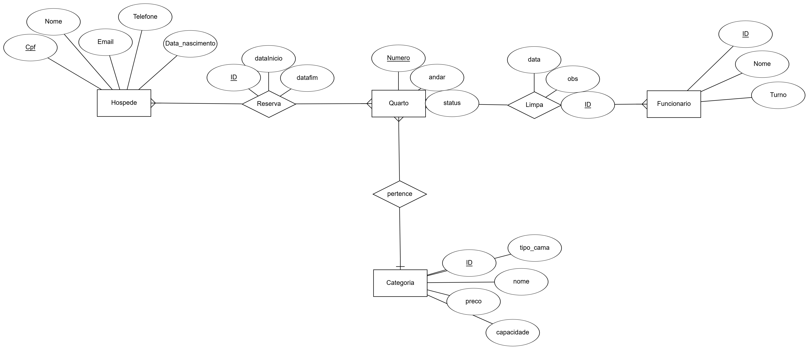

# Projeto Final: Sistema de Gerenciamento de Hotel
> Disciplina: Programação para Internet

Este projeto consiste em um sistema Web para o gerenciamento de operações hoteleiras, permitindo o controle de hóspedes, reservas, quartos e funcionários. O sistema foi desenvolvido seguindo a arquitetura Java Servlet, com persistência em banco de dados relacional e interface em HTML.

---

## Tecnologias e Arquitetura

O projeto segue o padrão MVC (Model-View-Controller) para garantir a separação de responsabilidades e facilitar a manutenção.

* **Frontend:** HTML5, CSS3 e JSP para páginas dinâmicas.

* **Backend:** Java Servlets (Java 8+).

* **Banco de Dados:** MySQL com persistência via JDBC.

---

## Modelagem do Banco de Dados

O banco de dados foi modelado para suportar o fluxo principal de um hotel, desde a categorização dos quartos até a limpeza realizada pelos funcionários.



### Descrição das Entidades
* **Hóspede:** Gestão de clientes com controlo de estado (Ativo/Inativo).
* **Quarto:** Unidades físicas vinculadas a categorias específicas.
* **Categoria:** Define o preço, capacidade e tipo de cama dos quartos.
* **Reserva:** Gerencia a estadia, garantindo que não haja sobreposição de datas.
* **Funcionário:** Registro de manutenção realizado por funcionários.

---

### Funcionalidades
1. Gestão de Reservas
* **Validação de Usuário:** Apenas hóspedes com status "Ativo" podem realizar novas reservas. Hóspedes inativos mantêm o acesso apenas ao histórico.

* **Conflito de Datas:** O sistema impede automaticamente reservas no mesmo quarto para períodos que se sobreponham.

2. Gestão de Quartos e Categorias

* **Cadastro Integrado:** Ao criar ou reservar um quarto, os detalhes da categoria (preço, capacidade) são exibidos dinamicamente para auxiliar na seleção.

---

## Estrutura do Projeto

```
src/main/java/
├── db/          # Conexão com o banco de dados (JDBC)
├── model/       # Classes de entidade 
└── servelet/    # Controladores da lógica de negócio

src/main/webapp/
├── componentes/ # Fragmentos de interface (Header/Footer/Menu)
├── WEB-INF/     # Configurações e bibliotecas
└── *.jsp/html   # Telas do sistema
```

---

## Status do Projeto
O projeto encontra-se em fase inicial de desenvolvimento. 
*Nota: Este projeto foi desenvolvido como requisito avaliativo e segue em constante evolução.*


